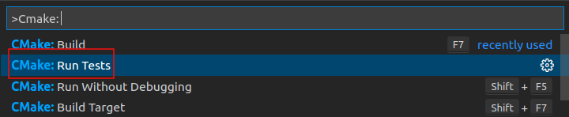
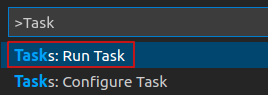
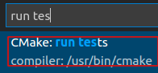
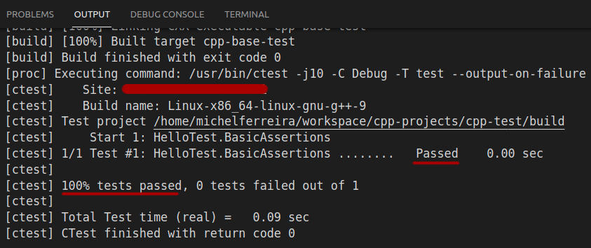
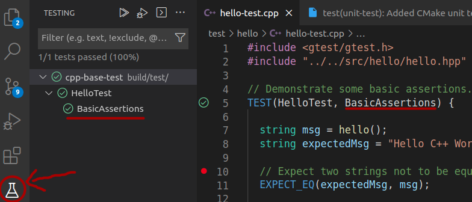

# Cpp base: template project

This is a `C++` base template structure to use in any vanilla/base project. This is great for testing and experiments.

This project use [VSCode](https://code.visualstudio.com) as a cross-platform editor.

> **Reference:** [VSCode: Introductory Videos for C++ ](https://code.visualstudio.com/docs/cpp/introvideos-cpp)

## Built With

**Linux / Mac**

* [GCC/G++](https://gcc.gnu.org)
* [Clang](https://clang.llvm.org)

**Windows**

* [Mingw](https://www.msys2.org)

**Any platform**

* [CMake](https://clang.llvm.org) **[optional]**

## Getting Started

1. Clone this repo

2. Open this project using [VSCode](https://code.visualstudio.com)

    > **PS:** Additionally, check the official tutorials of `C++` integration with `VSCode` (e.g [
    Using C++ on Linux in VS Code ](https://code.visualstudio.com/docs/cpp/config-linux))

3. Install recommended extensions such as [Microsoft C/C++ extensions](https://marketplace.visualstudio.com/items?itemName=ms-vscode.cpptools)

4. Run build task and/or debug on `VSCode` :)
    > **PS:** To build/debug with `CMake`, see this link here: [vscode-cmake-linux/Build hello world](https://code.visualstudio.com/docs/cpp/cmake-linux#_build-hello-world)

## Running tests

This project use [GoogleTest + CMake](http://google.github.io/googletest/quickstart-cmake.html). You can use [VSCode tasks](https://code.visualstudio.com/docs/editor/tasks) or execute `CMake: [action]` from [CMake Tools](https://marketplace.visualstudio.com/items?itemName=ms-vscode.cmake-tools) VSCode extension:

### Example: Running tests from Cmake Tools extension

1. Open the Comand Palette (`Ctrl+Shift+P`) and execute the command **`Cmake: Run Tests`**

    

2. Alternatively, Open the Comand Palette (`Ctrl+Shift+P`), but this time run the **VSCode Task** on:  `Run Task` => `CMake: run tests`

    

    

3. See the result output on **VSCode** terminal

    

Optionally, you can use the VSCode extension [vscode-catch2-test-adapter](https://marketplace.visualstudio.com/items?itemName=matepek.vscode-catch2-test-adapter) to see all tests in a panel on the left side of the editor.

> **PS:** For now, is necessary **build the code** before run tests on this panel (e.g using `Cmake: Build` command). There is a github issue with alternatives to solve this: [vscode-catch2-test-adapter#127](https://github.com/matepek/vscode-catch2-test-adapter/issues/127)